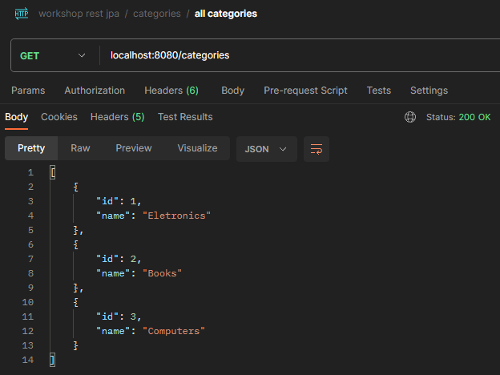

# Workshop Springboot3 JPA

## Description

This repository is a copy (with some changes) of the repository [workshop-springboot3-jpa](https://github.com/acenelio/workshop-springboot3-jpa) by [acenelio](https://github.com/acenelio) made in his course Java COMPLETO 2023 Programação Orientada a Objetos +Projetos.


## Prerequisites

- Java 8 or higher
- PostgreSQL

## Configuration

1. In `src/main/resources/application.properties`, the default profile is `test` which will use the in-memory H2 database. To view the database, run the API, and type the URL in your browser: `localhost:8080/h2-console`.

    ```bash
    spring.profiles.active=test
    ```
   
2. If you want to use PostgreSQL, switch the profile to `dev` and make the following settings:

    ```bash
    spring.profiles.active=dev
    ```

3. open `application-dev.properties`; 

4. Create a database with the name of your preference in postgresql, and insert its URL:

    ```bash
    spring.datasource.url=jdbc:postgresql://localhost:5432/springboot_course
    ```

5. Enter your username:

    ```bash
    spring.datasource.username=postgres
    ```

6. Enter your password:

    ```bash
    spring.datasource.password=1234567
    ```

## API Endpoints

### Users

- `GET users`: returns a list of all users.

  

- `GET users/{id}`: returns a user by id.

  

- `POST users`: Registers a user.

  

- `DELETE users/{id}`: Deletes a user by id.

  

- `PUT users/{id}`: Updates the data of a user by id.

  

### Categories

- `GET categories`: returns a list of all categories.

  

- `GET categories/{id}`: returns a category by id.

  

- `POST categories`: Registers a category.

  

- `DELETE categories/{id}`: Deletes a category by id.

  

- `PUT categories/{id}`: Updates the data of a category by id.

  

### Products

- `GET products`: returns a list of all products.

  

- `GET products/{id}`: returns a product by id.

  

### Orders

- `GET orders`: returns a list of all orders.

  

- `GET orders/{id}`: returns an order by id.

  
